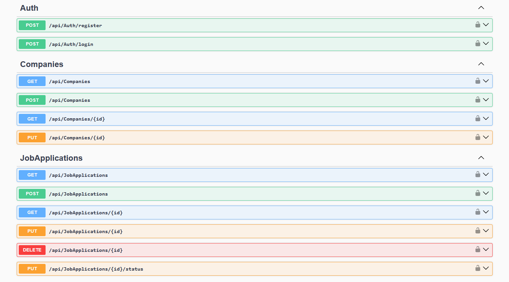

# Huntly

**Huntly** is a job application tracking REST API built with **C# and .NET 8**.

The project demonstrates modern backend development practices including:
- Clean Architecture (4 layers)
- Domain-Driven Design elements
- Repository pattern
- JWT authentication
- Docker containerization

The goal is to help developers track job applications, companies, interviews, and statuses throughout the job search process.

---

# Screenshot



---

# Features

## Job Applications
- Create and manage job applications with status tracking
- Track salary expectations, priority, and deadlines
- Automatic `AppliedDate` set when status changes to `Applied`
- Full lifecycle: Watchlist → Preparing → Applied → Interview → Offer → Accepted

## Companies
- Maintain a global company database
- Track company type, size, website, LinkedIn
- Associate technologies with companies

## Authentication
- User registration and login
- JWT Bearer token authentication
- BCrypt password hashing

---

# Tech Stack

## Language
- C# (.NET 8)

## Backend
- ASP.NET Core Web API
- Entity Framework Core 8 (Code-First, Migrations)
- PostgreSQL 16

## Architecture
- Clean Architecture (Domain / Application / Infrastructure / API)
- Repository pattern (Generic + Specific)
- Rich Domain Model
- Dependency Inversion Principle

## Auth
- JWT Bearer
- BCrypt.Net

## Validation
- FluentValidation

## Testing
- xUnit
- Moq
- WebApplicationFactory (Integration tests)
- EF Core InMemory (for tests)

## DevOps
- Docker
- Docker Compose

---

# Project Structure
```
Huntly
│
├── Huntly.Domain
│   Entities, Interfaces, Enums
│
├── Huntly.Application
│   Services, DTOs, Validators, Exceptions
│
├── Huntly.Infrastructure
│   Repositories, AppDbContext, JWT, BCrypt
│
├── Huntly.Api
│   Controllers, Middleware, Program.cs
│
└── Huntly.Tests
    Unit + Integration tests
```

---

# Getting Started

## Prerequisites
- Docker Desktop

---

## Installation
```bash
git clone https://github.com/aemuw/huntly.git
cd huntly
docker-compose up --build
```

API available at: `http://localhost:5000`

Swagger UI: `http://localhost:5000/swagger`

---

# API Overview

### Auth
```
POST   /api/auth/register
POST   /api/auth/login
```

### Companies
```
GET    /api/companies
GET    /api/companies/{id}
POST   /api/companies
PUT    /api/companies/{id}
```

### Job Applications
```
GET    /api/jobapplications
GET    /api/jobapplications/{id}
POST   /api/jobapplications
PUT    /api/jobapplications/{id}
PUT    /api/jobapplications/{id}/status
DELETE /api/jobapplications/{id}
```

All endpoints except `/api/auth/*` require JWT Bearer token.

---

# Architecture

## Clean Architecture Flow
```
Huntly.Api (Controllers, Middleware)
   ↓
Huntly.Application (Services, DTOs)
   ↓
Huntly.Domain (Entities, Interfaces)
   ↑
Huntly.Infrastructure (Repositories, EF Core)
```

## Request Flow
```
HTTP Request
   ↓
ExceptionMiddleware
   ↓
Controller
   ↓
Service (Application layer)
   ↓
Repository (Infrastructure layer)
   ↓
PostgreSQL (Docker)
```

---

# Application Status Flow
```
Watchlist → Preparing → Applied → PhoneScreen →
Technical → Final → Offer → Accepted
                   ↘ Rejected / Ghosted / Withdrawn
```

---

# Testing
```bash
dotnet test
```

- **Unit tests:** 21 (AuthService, JobApplicationService, CompanyService)
- **Integration tests:** 11 (AuthController, CompaniesController, JobApplicationsController)
- **Total:** 32 tests

---

# What I Learned

Through this project I practiced:
- Implementing **Clean Architecture** with 4 layers
- Building **REST APIs with ASP.NET Core**
- Using **Entity Framework Core** with Code-First migrations
- Working with **PostgreSQL** in a real project
- Implementing **JWT authentication** with BCrypt
- Containerizing applications with **Docker and Docker Compose**
- Writing **unit tests** with xUnit and Moq
- Writing **integration tests** with WebApplicationFactory
- Applying **SOLID principles** and **DDD elements**

---

# Roadmap

- [x] Clean Architecture (4 layers)
- [x] JWT authentication + BCrypt
- [x] PostgreSQL + EF Core Migrations
- [x] Docker + Docker Compose
- [x] FluentValidation
- [x] Unit + Integration tests
- [ ] Web UI (HTML/CSS/JavaScript)
- [ ] Interview tracking endpoints
- [ ] Skills checklist per job application
- [ ] Analytics endpoints (conversion rate, salary statistics)
- [ ] Technology tracking per company and application

---

# License
MIT
